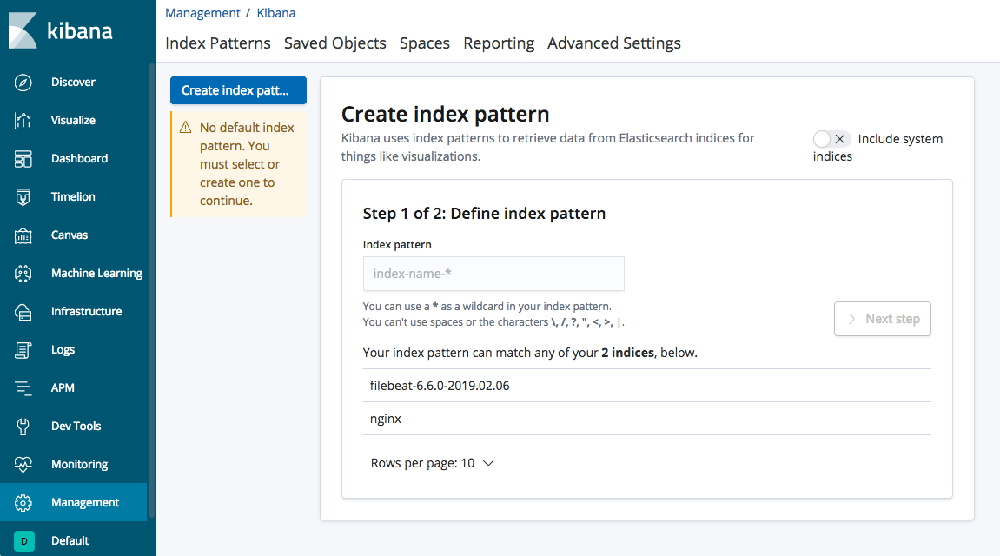
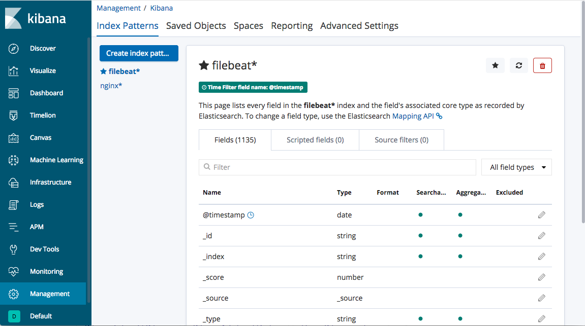
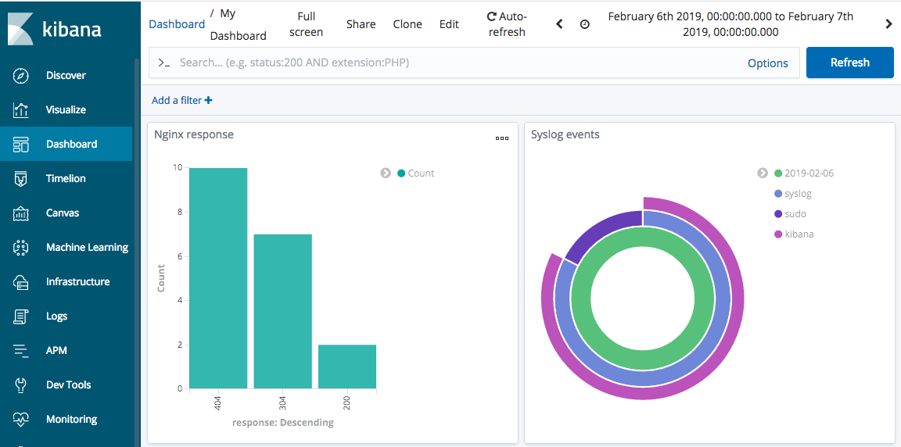

# Log Aggregation with Elastic-Stack 

#### This is a sample repo with example of how to ship Linux system logs and application logs (nginx) with Logstash and Filebeat to Elasticsearch and make a visualization with Kibana

### Pre-requisits

- vagrant
- git
- virtualbox

### High level overview


## How to run

#### Get the repo

```
git clone https://github.com/achuchulev/elastic-stack.git
cd elastic-stack
vagrant up
```

- `Vagrant up` will spin 2 VMs: 

  - elastic VM: Filebeat, Elasticsearch and Kibana - Filebeat collect all system logs and ship them to Elasticsearch
  - nginx VM: Nginx and Logstash - Logstash ship nginx logs to Elasticsearch

- All logs are shiped to Elasticsearch where being indexed. Kibana provides powerfull interface that lets us visualize our Elasticsearch data.

## How to use

- [Go to Kebana UI](http://192.168.57.57:5601)

- First a pattern of index should be created based on what Kibana has received from Elasticsearch. In this example we have filebeat for the system logs and logstash for the nginx logs



- Once the pattern/index name is saved, the Kibana interface should show you log events on the dashboard as shown below.



- Click the Discover link in the left-hand navigation bar. On the Discover page, select the predefined filebeat* index pattern to see Filebeat data. By default, this will show you all of the log data over the last 15 minutes. You will see a histogram with log events, and some log messages below:


- Use the left-hand panel to navigate to the Visualizatons tab to create diagrams, chrarts, pies etc. Saved visualizations can be imported into the Dashboard. 

For example, you can create a Dashboard to view detailed stats based on your syslog messages and what is the response codes count of Ngninx server.


